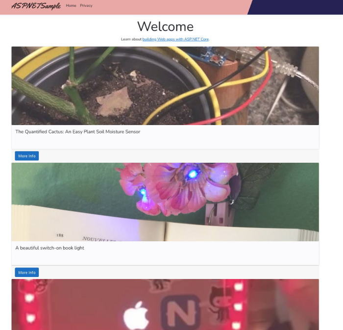

# An ASP.NET Sample Project

I'm following along with the '[ASP.NET 101](https://www.youtube.com/playlist?list=PLdo4fOcmZ0oW8nviYduHq7bmKode-p8Wy)' video series from Microsoft.

This is my first ever project with C#, and I'm hoping ASP.NET, Blazor, and Razor are analogous enough to the Javascript and MERN stack development I've learned so far to allow me to pick up on it quickly.

## My Thoughts So Far

### Through video 10

* I'm coming from Javascript, and I haven't worked with C/C++/Java since university, so coming back to a typed language is interesting. The verbosity can be annoying sometimes, but I do enjoy the extra checking - both from the language, and from myself reading over code and explicitly seeing the types.
* There is a lot of 'magic' happening. I need to keep in mind that this is an entire prescriptive *framework* and not just libraries and methods.
* Annotations feel weird to me. This is not a bad or good thing; just a thing. React and its jsx sugar that mimics HTML felt really elegant. Although, I am learning to enjoy the explicitness of the annotations.
* I may need to learn how to develop an ASP.NET project without using Visual Studio to gain more insight on what's happening.
